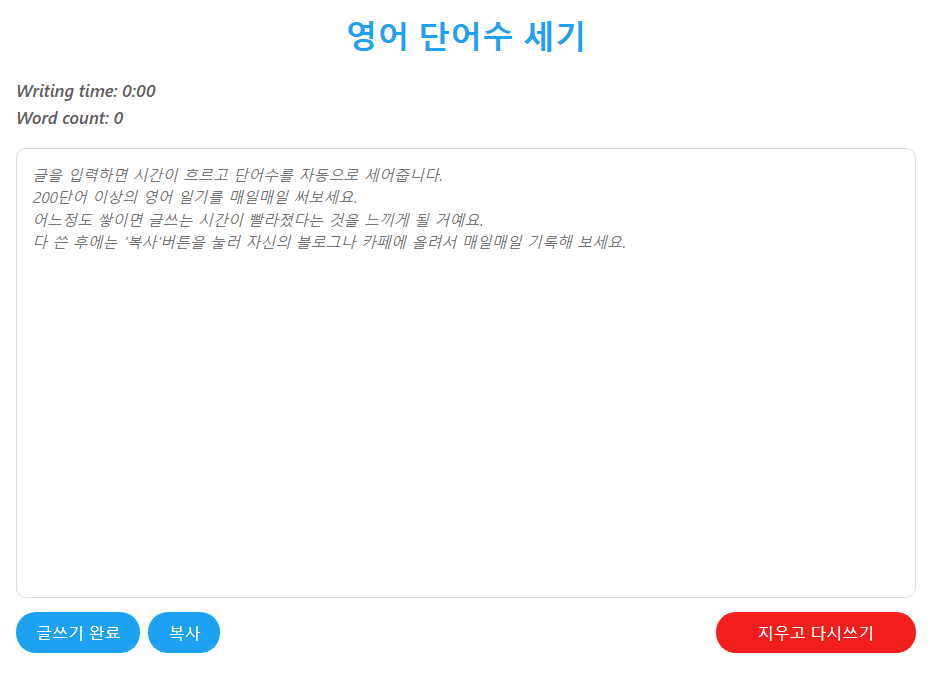

# Recent jobs

**English word counter** - React  
📅 *March 2025*
- [https://sunduk.github.io/englishword/](https://sunduk.github.io/englishword/)  
  

    

# Experience

### **Server Programmer**  
**NCSOFT**  
📅 *October 2020 – June 2025 (4 years 9 months)* | 📍 *Gyeonggi-do, Korea*  

**PC MMORPG, Blade&Soul** - C++, C#, Redis, MS-SQL  
- Eliminated manual management by migrating a legacy ranking server to a real-time one.
- Reduced latency between the game server and the ranking server from **1,000 ms to 100 ms** using a memory cache in ASP.NET. *(about 10x faster)*
- Identified query deadlocks by implementing an automated query executor.
- Improved the debugging process by implementing a **visual debugger** for game servers.

---

### **Program Team Leader**  
**IDLE Idea Factory**  
📅 *April 2018 – October 2020 (2 years 7 months)* | 📍 *Gyeonggi-do, Korea*  

**Mobile Idle Game, Abyssrium Pole** - C#, Unity, MySQL, Java, JSON  
- Improved game frame rates from **45 fps to 50 fps** by implementing custom shaders. *(about 5 fps faster)*
- Streamlined customer service by implementing a **concise user identification system** instead of using lengthy UUIDs.
- Eliminated the need to modify database tables by implementing a **user data system in JSON format**.
- Developed mobile **in-app purchase verification** using Java and implemented a rapid testing cycle with a mock system.

---

### **Program Team Leader**  
**Ligensoft**  
📅 *January 2011 – April 2018 (7 years 4 months)* | 📍 *Seoul, Korea*  

#### **Mobile Multiplayer Board Game, Star City Tycoon** - C#, Photon Server, MS-SQL, AWS EC2  
- Designed a casual game server with **multiple I/O threads and a single logic thread** to achieve high performance and ensure a safe coding environment.
- Reduced CPU usage from **70% to 50%** by implementing event signaling instead of polling.

#### **PC Management Game, Racing Manager** - C#, Unity  
- Developed a **one-click adjustment system** for designers to create more realistic driving paths with minimal effort.

---

### **Gameplay Programmer**  
**Joymax**  
📅 *June 2009 – October 2010 (1 year 5 months)* | 📍 *Seoul, Korea*  

**PC Online Casual Action Game, BumpyCrash** - C++  
- Replaced all **legacy functions** in the source code with new ones using regular expressions.
- Assisted designers in creating **combat scripts** for monsters.
- Enhanced artists’ work by implementing **shortcut systems** into an in-house tool.

---

### **Client Programmer**  
**Ligensoft**  
📅 *February 2007 – May 2009 (2 years 4 months)* | 📍 *Seoul, Korea*  

**PC Online Casual Action Game, RC Battler** - C++, Ogre3D, CEGUI  
- Implemented a **real-time layout adjustment system** in the game view, improving the creation process.

    

# Open Source Contributions

**English word counter** - React
📅 *March 2025*
- [https://sunduk.github.io/englishword/](https://sunduk.github.io/englishword/)
- A personal project for practicing React.

---

**OpenGL rendering** - C++, GLSL  
📅 *November 2023*
- [https://github.com/sunduk/opengl-3d-examples/](https://github.com/sunduk/opengl-3d-examples/)
- Created a series of 3D rendering examples using OpenGL.

---

**FreeNet** - C#, .NetCore  
📅 *October 2017*
- [https://github.com/sunduk/FreeNet/](https://github.com/sunduk/FreeNet/)
- Developed and maintained a network library in C# focused on high-performance networking.

    

# Publications

**Creating an Online Game Server Using C# for Unity Developers**  
📅 *May 2015*
- [https://www.hanbit.co.kr/store/books/look.php?p_code=E6015792502](https://www.hanbit.co.kr/store/books/look.php?p_code=E6015792502)  
  
 
